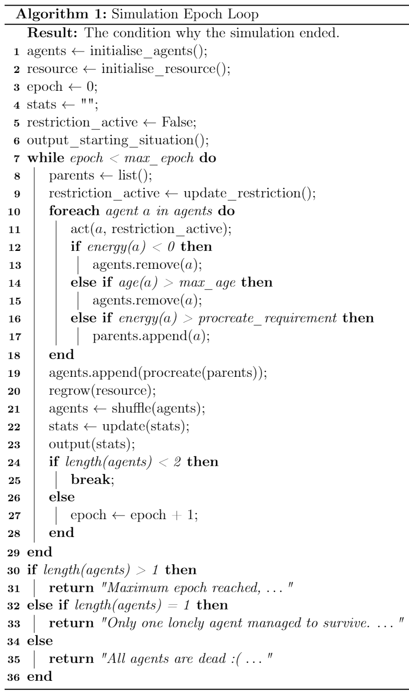

1. toc
{:toc title="Contents"}

# Introduction

On this page, the structure and architecture of the implementation is explained. The simulation is built using the object-oriented programming paradigm, which means that each entity (agent, resource, etc.) is represented by a `class` containing all its values and behaviours. The files that are relevant to the implementation model are:

```
D28-Tragedy_of_the_Commons/
├── cpr_simulation/
│   ├── __init__.py
│   ├── agent.py
│   ├── exception.py
│   ├── logger.py
│   ├── output.py
│   ├── parameters.py
│   ├── resource.py
│   ├── simulation.py
│   └── util.py
└── sim.py
```
* `__init__.py`: Module initiator file that determines that methods and attributes are exposed if `cpr_simluation` is imported as a module.
* `agent.py`: Contains the `Agent` class, specifying the behaviour of each agent.
* `exception.py`: Constains multiple custom exceptions that can be raised by `cpr_simulation`.
* `logger.py`: Contains the CSV logger logic.
* `output.py`: Contains the real-time plotting logic. 
* `parameters.py`: Contains the default parameter dictionary. For more information, refer to [Parameters](/D28-Tragedy_of_the_Commons/pages/parameters/).
* `resource.py`: Contains the `Resource` class, specifying the consumption and growth behavriour of the resource pool.
* `simulation.py`: Contains the `Simulator` class, wherein the simulation is set up and run. 
* `util.py`: Contains some context-free helper methods.
* `sim.py`: Contains the command-line interface and imports `cpr_simulation` to set-up and run a simulation. For more informatin about the command-line interface, refer to [Interaction](/D28-Tragedy_of_the_Commons/pages/interaction/).

In the sections below, the [`Agent`](#agent), [`Resource`](#resource) and [`Simulator`](#simulator) classes are more thoroughly explained. Thereafter a brief explanation of the [`ResultsPlotter`](#results-plotter) and [`CsvLogger`](#csv-logger) classes are given, finished by a short notice of the [utilities](#utilities) created and used.

# Agent 
```python
class Agent:
    # Attributes:
    #  - energy
    #  - social_value_orientation

    def __init__(self, params, **kwargs):
        # Class constructor

    @classmethod
    def from_svo_distribution(cls, dist_params, n, 
                              agent_params=dict()):
        # Generate set of n agents with their SVO's 
        # sampled from a multi-modal normal 
        # distribution 

    def act(self, sim):
        # Epoch behaviour entry point

    def base_energy_function(self, sim):
        # Base energy function behaviour

    def restricted_energy_function(self, sim):
        # Restricted energy function behaviour

    @classmethod
    def procreate(cls, sim, parents):
        # Procreation function

        def svo_either_parent():
            # SVO inheritance function based on
            # either parent

        def svo_both_parents():
            # SVO inheritance function based on
            # both parents
```
Because what would a common-pool resource be without any exploitants. 
{:.figcaption}

## Agent construction
The constructor of `Agent`, `Agent.__init__()`, constructs a new instance of the `Agent` class. It fills all attributes based on the parameter dictionary `params`. In addition, the static method `Agent.from_svo_distribution()` can be used to make a collection of agents, with their social value orientation drawn from a multi-modal normal distribution.

In this method, the means and standard deviations are passed through the `dist_params` argument. However, instead of using this to make a single multi-modal normal distribution, we make multiple unimodal distributions. For each agent, we take one such distribution by chance, and sample its social value orientation from that. This is mathematically equivalent so sampling all agents from a multi-modal distribution. 

The initial SVO distribution can be altered through the `svo_dist` parameter. Refer to [Parameters](../parameters/) for more information.
{:.note}

## Agent act
The behaviour 'act', represented by the method `Agent.act()`, represents the behaviour of this agent for an entire epoch. In our model, the act comprises of two things:
* Metabolise some energy (agent's energy level decreases)
* Decide whether to go fishing (energy leven increases)

How much energy the agent metabolises is decided by a parameter that's constant across all agents. 

The agents' fish consumption can be altered through the  `agent:metabolism` and `agent:consumption_factor` parameters. Refer to [Parameters](../parameters/) for more information.
{:.note}

Whether to go fishing, and how much fish to catch, is decided by the *energy function*. The outcome of these functions relies solely on the agent's social value orientation and the amount of resource that's left. This model implements two such functions, which both are described in the sections below.

The energy function used by the agents can be altered through the `agent:behaviour` parameter. Refer to [Parameters](../parameters/) for more information.
{:.note}

### Base energy function
The base energy function, represented by the method `Agent.base_energy_function()`, is the initially proposed agent behaviour function. This functions is very naive in that it makes a black and white separation between pro-self and pro-social agents (<.5 SVO means pro-self, >=.5 SVO means pro-social). While pro-social agents will always fish their consumption, the consumption of the pro-self agents differs based on the available resources.  
Let $$A_p\subseteq A$$ be the set of all pro-self agents as a subset of the set of all agents. Each agent $$a\in A_p$$ has a predetermined and constant metabolism value, which we define here as $$m$$. An agent consumes a little more than they need, which is why a predefined and constant consumption factor is added. Let us define this factor as $$c$$.  
Say that the total amount of resource that's available when agent goes fishing is denoted as $$f_a$$. If the amount of resource that available fish for each agent falls below a certain threshold (denoted $$s$$), pro-self agents start behaving differently. Their behaviour can be defined as follows:

$$
\begin{array}{lr}c_a=
    \begin{cases}
        m\cdot c\cdot g\ & \frac{f_a}{|A|}<s\\
        m\cdot c & \text{otherwise}
    \end{cases} & \forall a\in A_p
\end{array}
$$

### Restricted energy function (default)
The restricted energy function, represented by the method `Agent.restricted_energy_function`(), builds on the base function by adding a epoch-based resource restriction. 

The point at which the restriction kicks in or out can be altered through the `simulation:res_limit_factor` and `simulation:res_unlimit_factor` parameters respectively. Refer to [Restricted model limit parameters](../parameters/restricted-model-limit-parameters) for more information.
{:.note}

If this restriction is active, agents are only allowed to fish if they would die otherwise. However, each agent has a chance of ignoring this restriction. The probability hereof is linearly dependent of the agent's social value orientation, i.e. if they range more towards pro-selfness, they are inclined to ignore the restriction more often.  
However, agents that choose to ignore this rule have have a probability of being caught. If they are catched red-handed, they are punished and can't fish for a predetermined number of epochs. 

The probability of an agent being caught and the amount of epochs they can't fish if they are caught can be altered through the `agent:caught_chance` and `agent:caught_cooldown_factor` parameters respectively. Refer to [Agent-specific parameters](../parameters/#agent-specific-parameters) for more information.
{:.note}

## Agent procreation
If agents have enough energy available, they can procreate. The procreation is implemented in the static method `Agent.procreate()`. Repeatedly, two random agents are taken from the list of parents and they procreate. Apart from the child's social value orientation, all attributes remain constant. The child's social value orientation is dynamic however, and is chosen depending on the parents' social value orientations and energy levels. This model implements two social value orientation inheritance functions, which are described in the sections below.

The social value orientation inheritance function can be altered through the `agent:svo_inheritance_function` parameter. Refer to [General agent parameters](../parameters/#general-agent-parameters) for more information.
{:.note}

### SVO inheritance from either parent (default)
This function is represented by the local method `svo_either_parent()` that is located within `Agent.procreate()`. With this method, the child's social value orientation is based on one of their parents. We first have to decide which parent to take, which is done probabilisticly based on the parents' energy level:

$$
\begin{align}
P(\mu_c=svo_{p1}) &= \frac{e_{p1}}{e_{p1}+e_{p2}}\\[2em]
P(\mu_c=svo_{p2}) &= \frac{e_{p2}}{e_{p1}+e_{p2}}\\[2em]
&=1-P(\mu_c=svo_{p1})
\end{align}
$$

The probabilities of the child's mean svo to become that of both parents. Here, $$P(\phi )$$ denotes the probability that $$\phi$$.
{:.figcaption}

Notice that $$\mu_c$$ is used instead of $$svo_c$$. This because the social value orientation of the child is drawn from a normal distribution with a predetermined standard deviation. Thus we get:

$$
\begin{array}{ll}svo_c = \max(\min(\alpha,1),\ 0) & \alpha \sim \mathcal{N}(\mu_c, \sigma_c)\end{array}
$$

The social value orientation is drawn from a normal distribution. Here, $$\sigma_c$$ denotes the predetermined standard deviation
{.figcaption}

The standard deviation for the final normal distribution can be altered through the `agent:svo_convergence_factor:svo_either_parent` parameter. Refer to [General Agents Parameters](../parameters/#general-agent-parameters) for more information.

### SVO inheritance from both parents
This function is represented by the lcoal method `svo_both_parents()` that is located within `Agent.procreate()`. With this method, the child's social value orientation is based on both parents. As before, we construct a normal distribution where the social value orientation is sampled from. However, in this case the mean $$\mu_c$$ is determined by the weighted mean of the parents' social value orientations:

$$
\mu_c=\frac{svo_{p1}\cdot e_{p1} + svo_{p2}\cdot e_{p2}}{e_{p1}+e_{p2}}
$$

So the mean social value orienation of the child lies somewhere between the social value orientations of its parents. The standard deviation depends on the actual distance of $$\mu_c$$ from the parents' social valure orientations:

$$
\sigma_c=\frac{1}{3}\cdot \min(\vert\mu_c, svo_{p1}\vert, \vert\mu_c, svo_{p2}\vert)\cdot t
$$

Put in words, the extremes of the normal distributions ($$\pm 3\sigma_c$$) are made so that it will not exceed the parents' social value orientation. That is, if $$t$$ is set to 1. This factor can thus be used to allow for some exploration in the social value orientation search space. 

The value of $$t$$ can be altered through the `agent:svo_convergence_factor:svo_both_parents` parameter. Refer to [General agent parameters](../parameters/#general-agent-parameters) for more information.
{:.note}

# Resource
```python
class Resource:
    def __init__(self, params):
        # Resource pool constructor

    def growth_exponential(self, val, rate):
        # Exponential growth function

    def growth_logarithmic(self, val, a, t, s):
        # 1 / log growth function

    def growth_nroot(self, a, tx, ty, n):
        # 1 / nth root growth function

    def grow_resource(self):
        # Resource growth function entry point

    def consume_resource(self, amount):
        # Resource consumption entry pont
```

## Resource construction
The constructor of the `Resource`, `Resource.__init__()`, constructs a new instance of the `Resource` class. During construction, the attributes are set from the provided parameters. Furthermore a partial function is constructed for the resource regrowth. Finally the current amount of resources are set to the provided start amount.

## Growth functions
Three different growth functions are defined.

The active resource growth function can be altered through the `resource:growth_function` parameter. Refer to [Resource Parameters](../parameters/#resource-parameters). See [this example](../interaction/example-analyzing-resource-growth-functions) on how to check the behaviour of a growth function without interference of agents.

### The eponential function
The exponential resource growth function is defined as follows:

$$
\begin{align}
r_{t+1} &= r_t + f(r_t)\\[2em]
f(x) &= e\cdot x
\end{align}
$$

Note that this function in itself isn't exponential. However, when it is repeatedly applied each epoch, it will be. This function has one parameter, $$e$$, which determines the amount of exponential growth.

The exponent $$e$$ can be altered through the `resource:gf_params:exponential:rate` parameter. Refer to [Exponential growth function](../parameters/$exponential-growth-function) for more information. 
{:.note}

### The nth root function

The nth root function is defined as follows:

$$
\begin{align}
r_{t+1} &= r_{t} + g(r_t)\\[2em]
g(x) &= a\cdot\frac{1}{(x-\frac{t_x}{a})^\frac{1}{n}}-t_y
\end{align}
$$

The growth of the value of $$g(x)$$ decreases as $$r_t$$ increases. This allows for a radical resource growth at the start, but a more gradual resource growth if there is already a high amount of resources available. This function was designed to be resemble a 'nested' common-pool resource, where the lake is able to support but a limited amount of fish. The exponents $$a$$, $$t_x$$, $$t_y$$ and $$n$$ have the following implications to the behaviour of $$g(x)$$:

* $$a$$: Scales the whole function. Scales any properties that are already existent in the function.If all other values are set, this is value can be used to alter the amount of resource growth.
* $$t_x$$: Translation over the x axis. Alters the level of radicality in the beginning and the point at which the growth becomes more gradual.
* $$t_y$$: Translation over the y acis. Alters the 'base' amount of resource growth.
* $$n$$: Root base. This alters the speed at which the initial radicality changes to graduality. In a sense, this is the radicality redicality exponent. 

If the level of radicality of the initial growth is set too high, then all agents can feed off of the initial resource jump ($$r_t\rightarrow r_{t+1}$$ if $$r_t=1$$). This behaviour can be recognized by a flat, straight line of resources in the real-time resource plot.  
{:.note}

The exponents $$a$$, $$t_x$$, $$t_y$$ and $$n$$  can be altered through the `resource:gf_params:nroot:a`, `resource:gf_params:nroot:tx`, `resource:gf_params:nroot:ty` and `resource:gf_params:nroot:n` parameters, respectively. Refer to [NRoot growth function](../parameters/$nroot-growth-function) for more information. 
{:.note}


### The logarithmic function (default)

The logarithmic function is defined as follows:

$$
\begin{align}
r_{t+1} &= r_{t} \cdot h(r_t)\\[2em]
h(x) &= \frac{a}{\log(x)+\frac{a}{s-t}} + t
\end{align}
$$

This function was designed to account for the problem with the nth root function that agents can feed off of the initial jump, whilst keeping the radical-gradual pattern. In fact, as $$h(r_t)$$ scales the value of $$r_t$$ instead of adding up to it (as the previous two functions do), this growth function emits a gradual-redical-gradual resource growth pattern. The exponents $$a$$, $$s$$ and $$t$$ have the following implications to the behaviour of $$h(x)$$:

* $$a$$: Scales the whole function. Scales any properties that are already existent in the function.If all other values are set, this is value can be used to alter the amount of resource growth.
* $$s$$: Initial scale factor. If $$r_t=1$$, $$h(r_t)$$ will be equal to $$s$$. For all $$x>1$$, $$h(x)<s$$.
* $$t$$: Translation over x axis (roughly). Alters the speed at which the value of the function goes down, thus modifying the speed of the gradual-radical-gradual pattern. 

The exponents $$a$$, $$s$$ and $$t$$ can be altered through the `resource:gf_params:logarithmic:a`, `resource:gf_params:logarithmic:t` and `resource:gf_params:logarithmic:t` parameters, respectively. Refer to [Logarithmic growth function](../parameters/$logarithmic-growth-function) for more information. 
{:.note}


# Simulator
```python
class Simulator:
    def __init__(self, param_dict, printer=None, logger=None, 
                 row_head=[], verbose=True):
        # Params and modules initializer
    
    def get_agent_count(self, min_social_values=0, max_social_value=1):
        # Get amount of agents based on min and max SVO

    def add_agent(self, agent):
        # Adds an agent to the simulation
    
    def remove_agent(self, agent):
        # Removes an agent from the simulation

    def generate_simulation(self):
        # Initializes and runs the simulation

    def plot_results(self):
        # Updates the real-time plot

    def print_results(self):
        # Updates the command-line output

    def log_results(self):
        # Updates the CSV logger
```

This class is the spine of the simulation, hence its name. Here is where the agents and fish live and where the actual results of the model are produced by controlling both the community of agents and the common resource.

## Simulation construction
The constructor of `Simulator`, `Simulator.__init__()`, constructs a new intance of the `Simulator` class. Not only will this class set the values of its own attributes and variables, it will also receive the parameters for both the `Agent` and `Resource` classes, of which it will instantiate instances. Here the `Simulator` class also receives a reference to a `ResultPlotter` or `CsvLogger` class if specified via the command-line and/or instatiated in `main.py`. 
Furthermore, the thresholds for activating and deactivating the resource restriction are calculated.

## Simulation loop
The following subsections describe the workings of the main simulation loop, embedded in the `Simulator.generate_simulation()` function.
{:.note}

### Initialisation
Before the simulation goes into its simulation loop, the simulation is first initialised:
* First the list of agents is initialised using the [`Agent.from_svo_distribution()`](#agent-construction) function.
* Then the resources are [`initialised`](#resource-construction).
* The current statistics and epoch counter are reset.
* If required, the initial statistics are plotted, printed and logged.

### The epoch loop
Once initialisation is complete, the epoch loop starts. This loop will run untill either of the stopping conditions are met. There are two different stopping conditions:
1. Either the maximum amount of epochs are reached; or
2. The amount of alive agents drops under a certain threshold.
The first stopping condition can be specified by setting the `simulation:max_epoch` parameter. The second stopping condition is set to 2. This is done so since 1 agent will not be able to procreate, and will eventually die of age. It may however happen that all alive agents die all within the epoch, therefore we need to check whether $$|A|<2$$ (where $$A$$ denotes the set of alive agents), instead of $$|A|=1$$.

During each loop a few things happen in the following order:
1. Before the body of the loop starts, the first stopping condition is checked. If this passes the body of the loop is executed.
2. First the list of *parents* and *eol* (end of life) are reset.
3. Then it is checked whether the resource restriction should be active or inactive.
4. Then the list of alive agents is iterated through:
   1. First the agent acts.
   2. Then the consequences of its actions are determined (below points are mutually exclusive):
        * If the agent has an energy of <0 it is added to the *eol* list.
        * If the agent has become to old it is added to the *eol* list.
        * If the energy of the agent meets the procreate requirement it is added to the list of parents.
5. All agents on the *eol* list are removed from the simulation.
6. All agents on the *parents* list procreate, following the [agent procreation](#agent-procreation) function.
7. The resources [regrow](#growth-functions).
8. The list of agents is shuffled, to minimize the chance that the same agent gets to act first each epoch.
9. If required, the results are printed, plotted and/or logged.
10. Finally if the second stopping condition passes, the epoch counter is increased by 1 and the loop restarts.

### After the epoch loop
When the epoch loop has finished there are 3 possible states of the simulation:
1. The loop has finished due to epoch limit. This means that the simulation could've run longer and is therefore considered a success. The following result message is displayed: `"Maximum epoch reached, ..."`.
2. The loop has finished due to agent count. The first possibility is that there is just one agent left. Such a simulation is considered a failure. Then the following result message is displayed: `"Only one lonely agent managed to survive. ..."`.
3. The loop has finished due to agent count and there are no agents left. A simulation with such result is also considered to be a failure. In this case the following result message is displayed: `"All agents are dead :( ..."`

### Pseudocode
See below for the pseudocode representing a graphical overview of aforementioned explanation of the `Simulator.generate_simulation()` method.



# Output

## Results plotter
```python
class ResultsPlotter:
    def __init__(self, start_agent, svo_bar_count, start_resource, fullscreen):
        # Sets up all parameters and attributes of the class
    
    def init_plot(self):
        # Initializes the plot for the animation

    def update(self, data):
        # Updates the plot from the data provided

    def start_printer(self, data_gen):
        # Initializes the animation and shows the plot

    def save_fig(self, path):

```
Plots always give a good and quick overview of whats going on with the data, and the model in this case. By having this plot real-time, the progress of a simulation can be viewed directly without after-the-fact data analysis. Runs that did not provide satisfying results can then easily be discarded, since only those that do need to be explicitly saved. Refer to the [real-time plot output](../output/#real-time-plot) for a detailed explanation of the output of this class. This plot is intentionally kept minimal to keep plotting speed as high as possible. If more advanced plots are desired one should perform off-line data analysis using the data from the [CSV-logger](#csv-logger).

### ResultsPlotter construction
The constructor of `ResultsPlotter`, `ResultsPlotter.__init__()`, constructs a new instance of the `ResultsPlotter` class. During construction the figure and its subplots are initialised; the correct plot titles and axis labels are set. Furthermore, the various lines and histogram bars are initialised with the correct colors, labels and styles.

### FuncAnimation
The `ResultsPlotter` class uses the [`FuncAnimation`](https://matplotlib.org/3.3.2/api/_as_gen/matplotlib.animation.FuncAnimation.html#matplotlib.animation.FuncAnimation) class from the `animation` module of the `matplotlib` library. `FuncAnimation` works by repeatedly calling a function that yields the data to be plotted. Before the actual animation starts, an initialisation is called.
The animation initialisation is performed in the `init_plot()` method. Here all axis limits and data of the subplots are reset.

One would expect to do the initialisation all in one method (either the `init_plot()` or `__init__()` function). However the `FuncAnimation` can be set to run repeatedly (so restart each time a previous simulation ends). Each repeat then will call the initialisation function, before starting the animation. Resetting all subplots and their labels, axis limits and styles would be redundant..
{:.note}

The animation is started in the `start_printer()` function. The initialisation function is called from this method and the animation is started using the provided data generator (a function yielding the data for the plot). Each time the data generator yields new results the `update()` function is called.

#### Def update
Each time the `update()` function is called, the plot will update using the newly provided data. This new data is contained in the tuple provided as argument. The  `update()` function will update the underlying arrays containing the data, adjust the axis limits if required and update the actual lines and histogram.

#### Blit
One important argument of the `FuncAnimation` class to note is the `blit` argument. This argument changes the way the animation works internally. By settings this argument to `True` only the updated actors are drawn. Therefore the `init_plot()` and `update()` return the updated lines and histogram bars (which is not nessecary in normal plotting circumstances). This will make the plot significantly faster, since only a small part of each line is drawn each epoch. As a consequence however, the plot is reset when it is resized and when it reaches the end of the simulation. 

Sufficient measures have been put in place to circumvent this consequence of faster plotting. For example, the `--resize` parameter can be provided. This will set the `blit` argument to `False`. This will however cause the plot to become significantly slower. Furthermore the plot will become gradually slower since each epoch the full length of the 4 lines need to be redrawn, which means that each epoch more data needs to be redrawn.  
Additionally the plot is automatically saved after the simulation, allowing the plot to be viewed even when it resets after the simulation. As a downside however, this image is saved in a fixed `.png` format therefore reducing the scalability of the image.

## CSV logger
```python
class CsvLogger:
    def __init__(self, params, col_names, path=None, append=False):
        # Sets up the csv-logger with the parameters and column names provided

    def add_row(self, row):
        # Adds a row to the (currently in-memory) csvfile

    def write(self, path=None):
        # Writes the in-memory csv file to a hard-drive csv file
```
The CSV-logger is an important part of running multiple experiments, while allowing after-the-fact data processing. Refer to the [CSV logger output](../output/#csv-logger) for a detailed explanation of the exact formatting of the outputted CSV files.

Although the [`pandas`](https://pandas.pydata.org/) library is a well known library to work with tables and CSV files, this class actually uses a list of CSV formatted strings instead of a `pandas` dataframe. This is done so since `pandas.append(row)` is a relatively expensive operation compared to `list.append(str)`, and appending to a dataframe would've be the only used feature of `pandas` (apart from the `_to_csv()` function).
{:.note}

### CsvLogger construction
The constructor of the `CsvLogger`, `CsvLogger.__init__()`, constructs a new instance of the `CsvLogger` class. During construction the parameters, such as the separator and separator replacement, for the logger are set. Using the provided columns names, the number of columns is determined and the header string is generated.  

### Add row
In this function a new row is added to the list of CSV formatted string. If $$R$$ is the row to add, then $$R$$ should be a list of objects $$r\in R$$ such that $$\forall r\in R : str(r) \neq None$$ and $$|R|=n\_cols$$, where $$n\_cols$$ represents the amount of columns of the final CSV file.  

For each object $$r\in R$$ it is checked if `str(r)` contains the separator character. If so, it is replaced by the separator replacement character. Then all processed strings are joined together using the separator character and the resulting string is appended to the list of formatted strings.

### Write
The `write()` function writes the list of CSV formatted strings to a comma-separated values file. First the header string is added, then all the CSV formatted string are added to this file.

# Utilities
```python
class InvalidArgumentError(Exception):
    pass

class MissingArgumentError(Exception):
    pass

class InvalidParameterError(Exception):
    pass

# util.py
def do_nothing(self, *args, **kwargs):
    pass

def dd_factory(d=None):
    # asd

def update_dict(d, u, omit_new=False):
    # asd
```

Two different utility files were created:
* [`exception.py`](https://github.com/Leander-van-Boven/D28-Tragedy_of_the_Commons/blob/master/cpr_simulation/exception.py) used for custom exception handling.
* [`util.py`](https://github.com/Leander-van-Boven/D28-Tragedy_of_the_Commons/blob/master/cpr_simulation/util.py) used to generate a default parameter dictionary (`dd_factory()`) and to update one dictionary with the values of another dictionary (`update_dict`).
