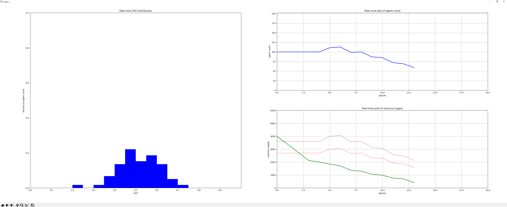

1. toc
{:toc title="Contents"}

# Verbosity
The most basic form of output, in the command-line itself.
The type of verbosity can be specified using the `--verbose [mode]`  or `-v` command-line argument together with the `run` command. Three different modes of verbosity are available:

## Minimal mode (`--verbose 0`)
This will only print out the number of the currently running experiment, together with the total amount of experiments to run. This verbose option is used as default when a batch of experiments are run, or when a range of experiments over some parameter values are run. The output will then be a single line in the command-line interface, which is being updated real-time. This line has the following formatting: `Iteration [c]/[t]`. Where `[c]` is the experiment that is currently running, and `[t]` is the total amount of experiments to run [^1].

```bash
Iteration 69/420
```
Example output when using `--verbose 0` while running multiple experiments
{:.figcaption}

## Standard mode (`--verbose 1`)
As is its name, this is the standard verbosity mode used when running a single experiment. It will 

```bash
restriction: ACTIVE,   epoch: 21, agent count: 85, resource: 45,352135 
```
Example output when using `--verbose 1` while running a single experiment
{:.figcaption}

This mode will also print a message when the simulation ends based on the way the simulation ended:

```
Maximum epoch reached, you managed to keep [x] agents alive!
```
The simulation reached the maximum amount of agents. `[x]` denotes the amount of agents that were alive when the epoch threshold was reached.
{:.figcaption}

```
Only one lonely agent managed to survive
He will stay on this forgotten island forever.
```
One agent was left, he can't procreate on its own and will die of age. Therefore the simulation is considered to be done.
{:.figcaption}

```
All agents are dead :(
There is no hope left for the village, just darkness.
```
All agents died, and agents can't spawn out of thin air. Therefore the simulation is considered to be done.
{:.figcaption}

## Detailed mode (`--verbose 2`)
The detailed verbosity mode is used when one would want to investigate each step of the simulation. The simulation is paused per epoch and the statistics of the simulation are printed in combination with the statistics of each alive agent. Move to the next epoch by pressing the _enter_ key. It is possible to quickly scroll through a few epochs by holding down the _enter_ key.

### Example output
```
---    EPOCH 1    ---

Agent count: 10
Available resource: 4000.00
Restriction: INACTIVE
  0     id=0    svo=0.41        pre=6.50        -met=1.50       UNRESTRICTED    +beh=10.50      post=10.50      LIVE
  1     id=1    svo=0.60        pre=6.50        -met=1.50       UNRESTRICTED    +beh=10.50      post=10.50      LIVE
  2     id=2    svo=0.49        pre=6.50        -met=1.50       UNRESTRICTED    +beh=10.50      post=10.50      LIVE
  3     id=3    svo=0.50        pre=6.50        -met=1.50       UNRESTRICTED    +beh=10.50      post=10.50      LIVE
  4     id=4    svo=0.31        pre=6.50        -met=1.50       UNRESTRICTED    +beh=10.50      post=10.50      LIVE
  5     id=5    svo=0.33        pre=6.50        -met=1.50       UNRESTRICTED    +beh=10.50      post=10.50      LIVE
  6     id=6    svo=0.56        pre=6.50        -met=1.50       UNRESTRICTED    +beh=10.50      post=10.50      LIVE
  7     id=7    svo=0.52        pre=6.50        -met=1.50       UNRESTRICTED    +beh=10.50      post=10.50      LIVE
  8     id=8    svo=0.55        pre=6.50        -met=1.50       UNRESTRICTED    +beh=10.50      post=10.50      LIVE
  9     id=9    svo=0.43        pre=6.50        -met=1.50       UNRESTRICTED    +beh=10.50      post=10.50      LIVE

EOL:  (tot 0)
Post act agent count: 10

Procreate:  (tot 0)
Post procreate agent count: 10

Resource: 3910.00,       growing 4195.15,       now 4195.15
Press enter to continue...

---    EPOCH 2    ---

Agent count: 10
Available resource: 4195.15
Restriction: INACTIVE
  0     id=9    svo=0.43        pre=10.50       -met=5.50       UNRESTRICTED    +beh=14.50      post=14.50      LIVE
  1     id=4    svo=0.31        pre=10.50       -met=5.50       UNRESTRICTED    +beh=14.50      post=14.50      LIVE
  2     id=7    svo=0.52        pre=10.50       -met=5.50       UNRESTRICTED    +beh=14.50      post=14.50      LIVE
  3     id=2    svo=0.49        pre=10.50       -met=5.50       UNRESTRICTED    +beh=14.50      post=14.50      LIVE
  4     id=3    svo=0.50        pre=10.50       -met=5.50       UNRESTRICTED    +beh=14.50      post=14.50      LIVE
  5     id=5    svo=0.33        pre=10.50       -met=5.50       UNRESTRICTED    +beh=14.50      post=14.50      LIVE
  6     id=0    svo=0.41        pre=10.50       -met=5.50       UNRESTRICTED    +beh=14.50      post=14.50      LIVE
  7     id=8    svo=0.55        pre=10.50       -met=5.50       UNRESTRICTED    +beh=14.50      post=14.50      LIVE
  8     id=1    svo=0.60        pre=10.50       -met=5.50       UNRESTRICTED    +beh=14.50      post=14.50      LIVE
  9     id=6    svo=0.56        pre=10.50       -met=5.50       UNRESTRICTED    +beh=14.50      post=14.50      LIVE

EOL:  (tot 0)
Post act agent count: 10

Procreate:  (tot 0)
Post procreate agent count: 10

Resource: 4105.15,       growing 4387.93,       now 4387.93
Press enter to continue...
```
Example command-line output of the first 2 epochs when using `--verbose 2` and 10 initial agents.
{:.figcaption}

# Real-time Plot
The real-time plot consists of 3 subplots.
1. Real-time agent SVO distribution histogram. This is the left subplot. It will show the percentage of currently alive agents that have a SVO within the range of each bar. Overwrite the `plotter_params:svo_bar_count` parameter to add more bars to the histogram, therefore decreasing the range of each range, thus increasing the resolution. 
2. The current agent count. This is the top-right subplot. It will show the currently alive agents over the epochs.
3. The current amount of resources and the thresholds of when to activate or deactivate the restriction of the restricted energy function. This is the bottom-right subplot. The <span style="color:green">green</span> line denotes the current amount of resource. The <span style="color:red">red</span> line shows the threshold under which the resource restriction is activated. The <span style="color:purple">purple</span> line shows the threshold above which the resource restriction is deactivated.

It is advised to not set the `plotter_params:svo_bar_count` paramater too high, since doing so will slow down the plot significantly.
{:.note}

The plot can be shown in a maximized window by specifying the `--fullscreen` argument.

Currently this is only supported on the `tkagg`, `qt4agg`, `qt5agg` and `wxagg` backends.
{:.note}

The plot can be resized during runtime. By default this will cause the plot to reset and start drawing from the first epoch after the resize. Specifying the `--resize` argument starts the plot in a different mode allowing it to resize without resetting. As a result however the plot will become *significantly* slower! Furthermore the plot will become gradually slower throughout the epochs as well.

When the simulation has finished, by default the plot will be saved in the background and automatically reset [^2]. In this case using the `resize` argument might be preferred when the figure needs to, for example, be saved in a certain format or size. Then the plot will not be reset after the simulation, allowing it to be resized or saved in a different format using the `matplotlib` ui-elements.

## Example plot
{:.lead loading="lazy"}
Example of real-time plot run for 13 epochs.
{:.figcaption}

# CSV-logger
The CSV logger logs the statistics of the simulation into a CSV- or [comma-separated values file](https://en.wikipedia.org/wiki/Comma-separated_values). This file can then be used for further data processing. Its usage becomes most optimal if combined with the [--range](/D28-Tragedy_of_the_Commons/pages/interaction/#batch-and-range) command-line argument. 

## Logged values
The contents in each row of the logger are split into two parts.
* The parameters of the experiment; and
* The statistics of the simulation at a certain epoch.

The former will change per experiment, the latter per call of the `add_row` function. Suppose $$S$$ the total set of simulations run [^1]. Say that, for each $$s\in S$$, the amount of epochs that $$s$$ reached is defined as $$e(s)$$. If the value of the `simulation:log_interval` parameter is then called $$i$$, the resulting CSV file will contain the following amount of rows: 

$$
1 + \left\lfloor\frac{\sum_{s\in S} e(s)}{i}\right\rfloor
$$

I.e. the sum of the amount of epochs per experiment divided by the interval on which was logged (`simulation:log_interval`) plus the csv header row.

When running experiments in a multi-threaded setting this will not hold. Refer to [Multi-threaded Experiments](#multi-threaded-experiments) for more information.
{:.note title="Imporant"}

### Experiment values
Each CSV file will contain at least one _Experiment Value_ column called 'Exp Num'. The value of this column will start at 0, stay the same throughout the epochs of a single simulation and is then increased with 1. This is similarl to how the 'iteration' value works in [Minimal Verbosity Mode](#minimal-mode---verbose-0).  
Since the model is quite extensive and contains a lot of parameters, it is not feasible to log all parameter values for each epoch. Especially considering the amount of epoch statistics that are being logged. Therefore the logger will only log the parameter values that make an experiment unique.  
There are a two cases that make an experiment unique and these are added to the columns in the following order:
1. The batch number of the current paramter combination, called `"batch"`.
2. All parameters overwritten using the [`range`](/D28-Tragedy_of_the_Commons/pages/interaction/#batch-and-range) argument, in the order they were overwritten. The name of the column is equal to the name of the parameter that is overwritten following the naming scheme of the [Parameters](/D28-Tragedy_of_the_Commons/pages/parameters) (specifying a range for the maximum epoch will result in a column named `"simulation:max_epoch"`).

A JSON file containing the values used for the other parameters can be obtained running the [`save`](/D28-Tragedy_of_the_Commons/pages/interaction/#specifying-a-certain-scenario) command.
{:.note}

### Epoch statistics
Each time the statistics of an epoch are logged, the following values are added to the right of the experiment values (in order of column location):
* The current epoch of the simulation that is currently being logged, called `"Epoch"`
* The current amount of resources, called `"Resource"`
* The current amount of agents alive, called `"Count"`
* The current amount of alive agents per SVO range:
  * $$(0.0,0.2]$$ (extremely pro-self), called `"A"`
  * $$(0.2,0.4]$$ (slightly pro-self), called `"B"`
  * $$(0.4,0.6]$$ (neutral), called `"C"`
  * $$(0.6,0.8]$$ (slightly pro-social), called `"D"`
  * $$(0.8,1.0]$$ (extremely pro-social), called `"E"`
* Statistics about the set of SVO values of the currently alive agents:
  * The median, called `"Median"`
  * The 40th percentile, called `"Below"`
  * The 60th percentile, called `"Above"`
  * The mean, called `"Mean"`
  * The standard deviation, called `"STD"`
* The current threshold for the restriction of the restricted energy function to become active. [link needed](#epoch-statistics). This column is called `"Resource Limit"`.
* The current threshold for the restriction of the restricted energy function to become active. [link needed](#epoch-statistics). This column is called `"Resource Unlimit"`.

# Multi-threaded Experiments
When multiple experiments are run in a multithreaded environment (i.e. [`--jobs >1`](/D28-Tragedy_of_the_Commons/pages/interaction/#multi-threading)), the output of the model is slightly altered.

## Graphical output
### Command-line interface
Since the Python module used to run multi-threaded experiments ([`joblib`](https://joblib.readthedocs.io/en/latest/)) provides its own command-line output, the mode of verbosity is ignored. When for example 500 experiments need to be executed on 5 different threads, the following output will be shown in the command-line instead:

```bash
Running 500 instances...
[Parallel(n_jobs=5)]: Using backend LokyBackend with 5 concurrent workers.
[Parallel(n_jobs=5)]: Done   6 tasks      | elapsed:    0.8s
[Parallel(n_jobs=5)]: Done  58 tasks      | elapsed:    3.3s
...
```
Example command-line output when running 500 experiments on 5 threads.
{:.figcaption}

### Real-time plot
Since multithreading is used to run a lot of experiments in parallel, it does not make sense to show an individual plot for each experiment run. Furthermore, while the plot of a previous experiment is still open, a new experiment on the same thread cannot start, thereby neglecting the benefit of running experiments in parallel.
Therefore the [`plot`](/D28-Tragedy_of_the_Commons/pages/interaction/#specifying-real-time-plotting-behaviour) argument is ignored when running experiments in a multi-threaded environment. Plotting the results from these experiments should be done in later data analysis.

## CSV logging
When running multiple loggers in parallel, proper file locking procedures should be put in place if each logger would need to append its data to the same CSV file. Additionally, memory concerns will arise when opening and closing an ever growing file. Therefore each experiment is put in a seperate CSV file put in the folder specified by the [`out`](/D28-Tragedy_of_the_Commons/interaction/#output-path-for-csv-logging) argument. Each CSV file is then named using the following naming schedule: `run{experiment_number}.csv`. The `experiment_number` goes from 0 to (excluding) the total amount of experiments that were run [^1]. The first _parameter\_combinations_ amount of files will then contain the first batch of each different parameter combination before it run the second batch of each parameter combination. If there is only one parameter combination, there will be _batch_ amount of files. Each _n_-th file containing the _n_-th batch.

[^1]: This can be calculated using the formula as given in the [Interaction](/D28-Tragedy_of_the_Commons/pages/interaction/#total-amount-of-experiments) page.
[^2]: Although not preferred, this is done automatically by the `matplotlib` library and cannot be prevented. The image containing the plot can be found in the base directory and is called `".lastplot.png"`. Otherwise the [`save`](/D28-Tragedy_of_the_Commons/pages/interaction/#specifying-a-certain-scenario) command can be executed, saving both the plot and used parameters in a new scenario folder.